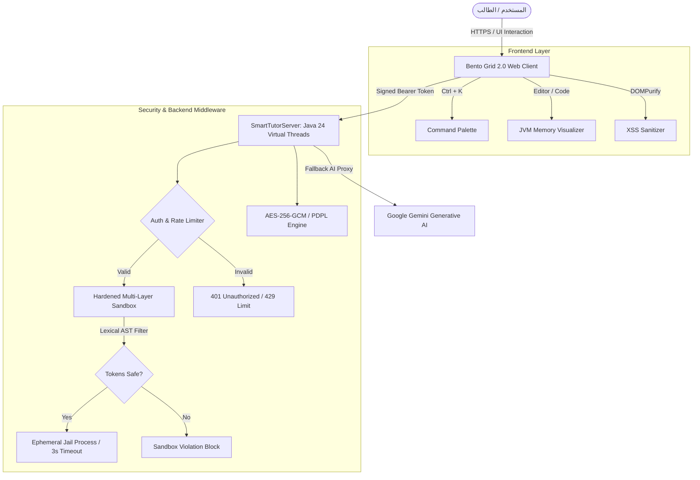

# سِنَاد | Senad AI Smart Java Academic Tutor 🎓⚡

<div align="center">


<br/>

**المنصة التعليمية الذكية لتبسيط وشرح لغة جافا وهياكل البيانات، محاكاة الذاكرة الحية، والتحديات البرمجية المؤتمتة لطلاب كليات علوم الحاسب وتقنية المعلومات.**

[🚀 الدخول للمنصة](#-دليل-التشغيل-السريع-quick-start) •
[✨ المميزات التقنية](#-المميزات-الرئيسية-key-features) •
[🔒 التحصين الأمني](#-التحصين-الأمني-وهندسة-العزل-security-matrix) •
[🏛️ شكر وتقدير](#-شكر-وتقدير-acknowledgments)

</div>

---

## 🌟 نظرة عامة (Overview)

تم بناء **سِنَاد (Senad AI)** كمنصة تعليمية متكاملة مصممة خصيصاً لطلاب الجامعات (جامعة الإمام محمد بن سعود الإسلامية وكليات علوم الحاسب في المملكة). تجمع المنصة بين قوة خادم **Java 24** فائق الأداء القائم على **Virtual Threads**، ونماذج الذكاء الاصطناعي التوليدي **Google Gemini**، مع واجهة مستخدم مستقبلية بنمط **Bento Grid 2.0** و **Glassmorphism Pro**.

---

## ✨ المميزات الرئيسية (Key Features)

### 1. ⚡ محاكي ذاكرة الـ JVM التفاعلي (Interactive Memory Visualizer)
* **Call Stack Frames:** تتبع مسار استدعاء الدوال وتوزيع المتغيرات المحلية (Local Variables).
* **Heap Allocations:** مراقبة حجز الكائنات والمصفوفات عبر `new` مع عناوين الذاكرة التقديرية (`@0x7f4a`).
* **Metaspace & GC:** محاكاة استهلاك الميتا-داتا ودورات جمع القمامة (Garbage Collection).

### 2. 🏆 تحديات البرمجة اليومية ولوحة الشرف (Daily Challenges & Test Runner)
* **6 مسائل برمجية متدرجة:** (توازن الأقواس `Stack`، مجموع العددين `Two Sum`، العدد المتماثل `Palindrome`، البحث الثنائي `Binary Search`، والمضروب `Recursion`).
* **Automated Test Runner:** فحص آلي لكافة حالات الاختبار (Test Cases) في بيئة جافا الحقيقية وإرجاع تقارير دقيقة لكل حالة.
* **نظام النقاط والمكافآت (XP & Leaderboard):** تحديث فوري لترتيب الطلاب وسلسلة المذاكرة اليومية (Streak 🔥).

### 3. 🤖 المعلم البرمجي الذكي (Senad AI Copilot)
* تحليل الأكواد سطر بسطر واكتشاف الأخطاء وتقديم شروحات أكاديمية مبسطة.
* دعم استخراج النصوص البرمجية من الصور والسلايدات عبر محرك **Tesseract.js WASM OCR**.
* توليد مخططات الكلاسات الذكية **UML Class Diagrams**.

### 4. 🎨 واجهة وتجربة مستخدم عصرية (Next-Gen Bento Grid 2.0)
* **شريط الأوامر السريع (Command Palette `Ctrl + K`):** بحث وتنقل فوري وتنفيذ الأوامر بدون لمس الفأرة.
* **نظام الألوان والخطوط الفاخرة:** خطوط **Outfit** و **Cairo** و **JetBrains Mono** مع دعم الوضع الليلي والنهاري.

---

## 🔒 التحصين الأمني وهندسة العزل (Security Matrix)

تم تطبيق أعلى معايير البرمجة الآمنة (Secure Coding Standards) في المنصة:

| محور الحماية | التقنية المطبقة | الوصف الأمني |
|---|---|---|
| **RCE & Sandbox Isolation** | Lexical Regex AST + Ephemeral Jail | حظر `Runtime`, `ProcessBuilder`, `java.io.File`, `System.exit` وعزل التنفيذ تحت قيود `-Xmx32m`. |
| **Timeout Protection** | Hard Watchdog (3000ms) | إنهاء أي عملية تتجاوز 3 ثوانٍ بالقوة (`destroyForcibly`) للحماية من الحلقات اللانهائية وهجمات DoS. |
| **Authentication Middleware** | Server-Side OTP + HMAC-SHA256 | التحقق من الهوية الأكاديمية وحظر الطلبات غير المصرح لها برمز `401 Unauthorized`. |
| **PDPL Compliance** | AES-256-GCM Encryption | تشفير سجلات ودرجات الطلاب وفق نظام حماية البيانات الشخصية السعودي. |
| **XSS & Injection Defense** | DOMPurify + CSP Headers | تنقية المخرجات بـ DOMPurify وتفعيل ترويسات `Content-Security-Policy` و `X-Frame-Options: DENY`. |
| **Rate Limiting** | Token Bucket Algorithm | تقييد سقف الطلبات بـ **30 طلباً/دقيقة** لكل عنوان IP للوقاية من الـ Brute-Force. |

---

## 🏗️ المعمارية التقنية ومخطط تدفق البيانات (Architecture)



---

## 📂 الهيكل التنظيمي للمشروع (Project Structure)

```text
java-smart-tutor/
├── server/
│   └── SmartTutorServer.java       # الخادم الرئيسي فائق الأداء والمحمي (Java 24)
├── public/
│   ├── index.html                  # الواجهة الرئيسية الموحدة بنظام Bento Grid
│   ├── css/
│   │   └── style.css               # نظام التصميم الزجاجي والأنماط التفاعلية
│   └── js/
│       ├── app.js                  # مشغل التطبيق وشريط الأوامر Ctrl + K
│       ├── analyzer.js             # محلل الأكواد ومحاكي الذاكرة JVM Visualizer
│       ├── challenges.js           # محرك التحديات اليومية وفحص Test Cases
│       ├── auth.js                 # نظام تسجيل الدخول والتوثيق الثنائي OTP
│       ├── chat.js                 # مساعد الشات الأكاديمي الذكي
│       ├── slides.js               # محلل السلايدات والاختبار التجريبي
│       ├── ocr.js                  # محرك استخراج الأكواد من الصور
│       ├── security.js             # مركز تشفير PDPL AES-256-GCM
│       └── data.js                 # البيانات المرجعية والمناهج الأكاديمية
├── .env.example                    # نموذج إعدادات البيئة
├── .env                            # ملف المتغيرات والمفاتيح السرية (محمي)
├── .gitignore                      # قواعد استبعاد الأسرار ومخرجات البناء
└── README.md                       # التوثيق الشامل للمشروع
```

---

## 🚀 دليل التشغيل السريع (Quick Start)

### المتطلبات الأساسية:
* **Java Development Kit (JDK 21 LTS أو JDK 24)**.
* متصفح حديث (Chrome / Edge / Firefox / Safari).

### خطوات التشغيل:

1. **استنساخ المستودع (Clone):**
   ```bash
   git clone https://github.com/your-username/java-smart-tutor.git
   cd java-smart-tutor
   ```

2. **تجهيز ملف البيئة (.env):**
   ```bash
   cp .env.example .env
   # قم بتعديل المفاتيح السرية داخل ملف .env
   ```

3. **تجميع وتشغيل خادم الجافا:**
   ```bash
   # تجميع الكود
   javac -d out server/SmartTutorServer.java

   # تشغيل الخادم
   java -cp out server.SmartTutorServer
   ```

4. **فتح المنصة:**
   * افتح المتصفح على الرابط: **`http://localhost:8080`**.
   * استمتع بتجربة لوحة التحكم التفاعلية ومحاكي الذاكرة والتحديات اليومية!

---

## 🏛️ شكر وتقدير (Acknowledgments)

نتقدم بجزيل الشكر والتقدير إلى:

* **[أكاديمية سدايا (@SDAIAAcademy)](https://github.com/SDAIAAcademy)**:
  الهيئة السعودية للبيانات والذكاء الاصطناعي (SDAIA) لدورها الرائد في تمكين الكفاءات الوطنية، وتطوير المهارات التقنية المتقدمة في مجالات الذكاء الاصطناعي وهندسة البرمجيات في المملكة العربية السعودية 🇸🇦.
* **كلية علوم الحاسب والمعلومات - جامعة الإمام محمد بن سعود الإسلامية (IMSIU)**.

---

<div align="center">
  <sub>تم التطوير بكل فخر لدعم التحول الرقمي الأكاديمي وتمكين طلاب علوم الحاسب 🚀</sub>
</div>
